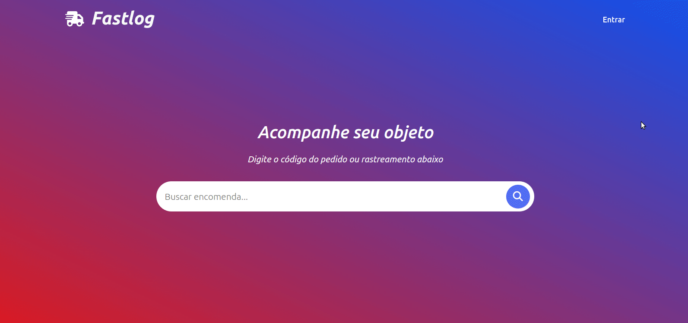

# About the project / *Sobre o projeto*

This is a delivery fleet management application for a carrier company, where the authorized user is able to register different modes of transport and corresponding vehicles, as well as a price list and deadlines. The application allows the user to request a freight quote according to the chosen mode, where the system calculates and returns the value with the delivery time. The system also allows the user to consult the status of quotations made, with no need to be authenticated in this case. Full stack app developed with Ruby on Rails technology, ORM Active Record and SQLite database, with numerous unit and system tests with RSPec and Capybara to ensure code quality.

---

*Este é um aplicativo de gerenciamento de frota de entrega de uma transportadora, onde o usuário autorizado é capaz de cadastrar diversas modalidades de transporte e veículos correspondentes, assim como tabela de preços e prazos. A aplicação permite ao usuário solicitar uma cotação de frete de acordo com a modalidade escolhida, onde o sistema calcula e retorna o valor com o prazo de entrega. O sistema também permite ao usuário consultar o status de cotações realizadas, não havendo necessidade de estar autenticado nesse caso. App full stack desenvolvido com a tecnologia Ruby on Rails, ORM Active Record e banco de dados SQLite, com inúmeros testes unitários e de sistema feito com RSpect e Capybara para garantir a qualidade do código.*

---
# Skills / *Habilidades*

  - Full Stack development / *Desenvolvimento Full Stack*
  - Ruby on Rails
  - ORM Active Record
  - User validation with Devise / *Validação de usuário com Devise*
  - Bootstrap
  - SQLite database / *Banco de dados SQLite*
  - RSpec / Capybara (tests)

---
# Layout

---
# Resources and Technologies / *Recursos e Tecnologias*

  - Ruby 3.1.1
  - Rails 7.0.4
  - SQLite 1.4
  - Puma 5.0
  - Rails-i18n
  - Devise
  - Chartkick
  - Bootstrap (link)
  - Font Awesome 6.2.1
  - RSpect-rails
  - Capybara

---
# Running tests / *Executando testes*

All tests - command:        rspec --format=documentation
Transport modes - command:  rspec --format=documentation ./spec/system/modes
Vehicles - command:         rspec --format=documentation ./spec/system/vehicles
Prices - command:           rspec --format=documentation ./spec/system/prices
Deadlines - command:        rspec --format=documentation ./spec/system/deadlines

---
# Deployment / *Implantação*

See it in action/ **Veja em ação**: [https://xxxxxxxxxxxxxx.app/](https://xxxxxxxxxxxxx.app/)

Commands:

- git clone git@git-qsd.campuscode.com.br:kelson/logistics-system-in-ruby-on-rails.git
- Run rails db:create
- Run rails db:migrate
- Run rails db:seed
- Run rails server
- Access http://localhost:3000, register a new user, ready to go.
